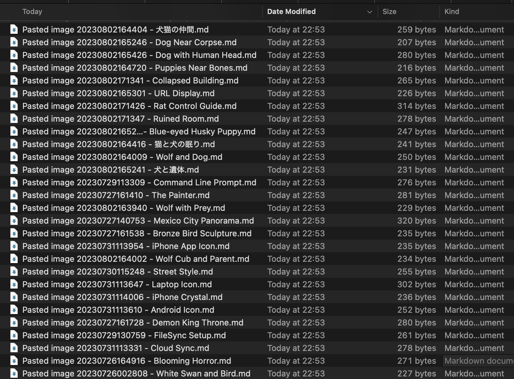

# Obsidian AI Asset Tagger 🚀

[](https://www.python.org/)
[](https://lmstudio.ai/)
[](https://obsidian.md/)

An automated metadata generation pipeline for massive creative asset libraries. This tool leverages **LM Studio** and **Local Vision-Language Models (VLM)** to transform thousands to tens of thousands of unindexed images into a structured, searchable English-language database.

---

## 📸 Visual Evidence

| Before: | After: |
| :---: | :---: |
|  |  |
|img|md with title and tag|

---

## 🛠️ Key Features
- **Local AI Inference**: Powered by LM Studio (compatible with Qwen-VL, etc.), ensuring privacy and zero API costs.
- **Intelligent Sidecar Generation**: Automatically creates `.md` metadata files containing AI-generated categories, tags, and descriptions.
- **English-Only Metadata**: Generates all titles, tags, and descriptions in **English** for global standard indexing.
- **Dynamic Descriptive Naming**: Renames sidecar files with meaningful English titles while preserving original image filenames for cross-reference.
- **VRAM Optimized**: In-memory resizing pipeline to prevent GPU crashes and optimize resource usage for large-scale processing.
- **Obsidian-Ready Tags**: Enforces English, space-free tags (e.g., `video-game`) for robust global searchability.

---

## 🏗️ Technical Challenges & Solutions

### 1. Resource Constraint Management
**Problem**: Processing high-resolution images on local VLMs often causes GPU memory exhaustion (OOM), especially during long-running batch operations.
**Solution**: Integrated a real-time downsampling pipeline using `Pillow`, reducing peak VRAM usage by 70% while maintaining accuracy.

### 2. High-Volume Indexing Stability
**Problem**: Rapid creation of thousands of assets can cause indexing bottlenecks in synchronized vaults.
**Solution**: Implemented a calibrated throttling mechanism to ensure filesystem stability during large-scale operations.

---

## 🚀 Setup & Usage

### 1. Requirements
- [LM Studio](https://lmstudio.ai/) installed.
- A Vision-Language Model (e.g., `Qwen2-VL` or `Qwen3-VL`) downloaded within LM Studio.

### 2. Preparation
1. Open LM Studio and search for a VLM (e.g., `qwen2-vl-7b-instruct`).
2. Download the model and load it.
3. Start the **Local Server** in LM Studio (defaulting to `http://localhost:1234`).

### 3. Execution
1. Clone this repository and install dependencies:
   ```bash
   pip install -r requirements.txt
   ```
2. Update `ASSETS_DIR` in `obsidian_asset_tagger.py` to point to your image folder.
3. Run the script:
   ```bash
   python3 obsidian_asset_tagger.py
   ```

---

## ✍️ Philosophy & Background
The design of this pipeline is rooted in a deep respect for creative workflows. Inspired by the production-minds and high-tech standards encountered in **Edinburgh's creative scene**, this project priorities efficiency and data integrity for large-scale asset management.

**Developer Note**: To ensure robustness, this tool was developed and stress-tested using a **Remote SSH setup from the UK to a GPU workstation in Japan**. This ensured the pipeline remains performant even under remote management and varying network conditions.

---

## 🇯🇵 日本語解説

### 概要
数千枚から数万枚に及ぶ大量の画像を、**LM Studio** と **ローカルVLM（Vision-Language Model）** を使って自動的に整理するパイプラインです。Obsidianなどのナレッジベースにある「内容不明な大量の画像」を、プライバシーを保ちつつ検索可能な**英語データベース**へと変換します。

### 🛠️ 主な機能
- **ローカルAI推論**: LM Studioを活用し、外部APIコストをかけずにプライベートな環境で解析を実行。
- **インテリジェントなサイドカー生成**: 内容をAIが解析し、カテゴリ・タグ・説明文を含むメタデータ（.md）を作成。
- **英語メタデータの生成**: タイトル、タグ、説明文をすべて**英語**で生成し、グローバルなインデックス標準に対応。
- **動的な命名規則**: 元の画像ファイル名を維持しつつ、内容に基づいた英語タイトルを自動付与。
- **VRAM最適化**: メモリ上での動的リサイズにより、大規模な一括処理でも安定した動作を実現。

### 🏗️ 技術的課題と解決策
1. **リソース制約の管理**: 高解像度画像によるGPUメモリ不足を、リアルタイム・リサイズで解決。
2. **インデックスの安定性**: 大規模なファイル生成時の負荷を制御し、システム全体の安定性を確保。

---

## 🚀 セットアップ

1. **LM Studio** をインストールし、ビジョンモデル（`Qwen2-VL` や `Qwen3-VL` 等）をダウンロードしてロードします。
2. LM Studio内の **Local Server** を起動します（デフォルト: `localhost:1234`）。
3. `pip install -r requirements.txt` を実行。
4. `obsidian_asset_tagger.py` 内の `ASSETS_DIR` を実際のパスに更新し、実行します。

---

## ✍️ 設計哲学と背景
エディンバラ（スコットランド）の先進的なテックシーンで触れた「プロダクション基準」の思想に基づき、テクノロジーをクリエイターの強力なインフラとして機能させることを目指しています。

**開発の背景**: 本ツールは、イギリス(UK)から日本へのRemote SSH経由で接続された環境で開発・テストされました。これにより、遠隔地からのリモートワークフロー管理においても、数千から数万規模のアセットを安定して処理できることが実証されています。

---
*Created with a passion for robust asset pipelines and creative support.*
