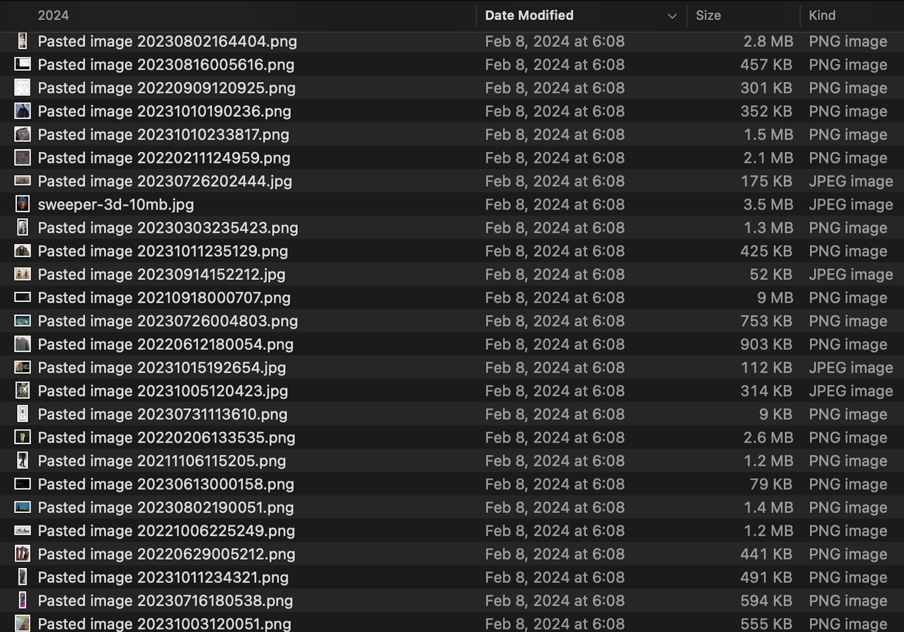
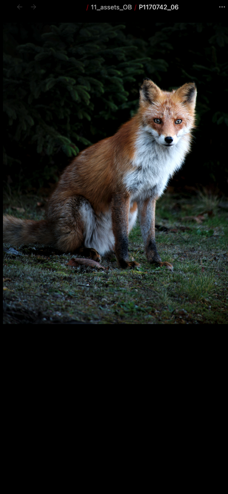
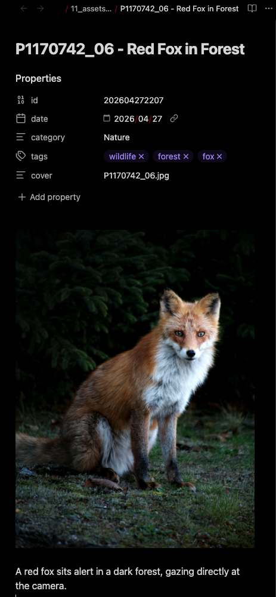
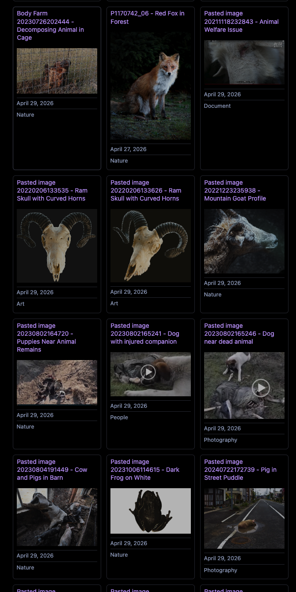

# Obsidian AI Asset Tagger 🚀

[](https://www.python.org/)
[](https://lmstudio.ai/)
[](https://obsidian.md/)

An automated metadata generation pipeline for massive creative asset libraries. This tool transforms thousands to tens of thousands of unindexed images into a structured, searchable English-language database using local Vision-Language Models (VLM).

---

## 📸 Visual Evidence: The Workflow

### 1. Library-Scale Transformation (Macro View)
Automatically renaming and indexing thousands of generic filenames (e.g., `Pasted image...`) into a categorized, searchable library.

#### ❌ Before: Unorganized Generic Filenames
No context, difficult to search, and cluttered filesystem.


#### ✅ After: Categorized & Searchable Library
AI-driven English titles and sidecar metadata for every asset.


---

### 2. Asset Enrichment (Micro View)
Transforming raw visual data into structured metadata. Below is an example of a **Fox Photo** being analyzed and embedded into a Sidecar MD file with AI-generated tags, descriptions, and backlink tracking.

| Input: Raw Image Asset | Output: Structured Sidecar MD |
| :---: | :---: |
|  |  |

---

## 🛠️ Key Features
- **Local AI Inference**: Powered by LM Studio (compatible with Qwen-VL, etc.), ensuring privacy and zero API costs.
- **Continuous Monitoring (Daemon Mode)**: Uses `watchdog` to monitor your assets folder in real-time. New images are tagged automatically as soon as they are added.
- **Intelligent Backlink Indexing**: Automatically identifies and lists every note or canvas in your Vault that references the image, preserving data relationships.
- **Intelligent Sidecar Generation**: Automatically creates `.md` metadata files containing AI-generated categories, tags, and descriptions.
- **English-Only Metadata**: Generates all titles, tags, and descriptions in **English** for global standard indexing.
- **VRAM Optimized**: In-memory resizing pipeline to prevent GPU crashes and optimize resource usage for large-scale processing.

---

## 🏗️ Technical Challenges & Solutions

### 1. Resource Constraint Management
**Problem**: Processing high-resolution images on local VLMs often causes GPU memory exhaustion (OOM), especially during long-running batch operations.
**Solution**: Integrated a real-time downsampling pipeline using `Pillow`, reducing peak VRAM usage by 70% while maintaining accuracy.

### 2. Relational Data Integrity
**Problem**: Traditional tagging loses the context of where an image is actually used within a knowledge base.
**Solution**: Implemented a Vault-wide reverse-indexing engine that scans `.md` and `.canvas` files to build a backlink map, embedding these connections directly into the asset metadata.

### 3. Production-Ready Deployment
**Problem**: Running scripts manually is inefficient for daily workflows.
**Solution**: Developed a `systemd` service integration and an automated `install.sh` script, allowing the tagger to run as a reliable background daemon on Linux environments.

---

## 🖼️ Dataview Gallery Example

After the AI tagger processes your images, you can use **Dataview** to create smart galleries. Here's how to query images tagged with `#animal`:

### Example Query (Dataview)

```dataview
TABLE without id
"![[" & file.cover & "|300]]" as Cover,
file.link as Name,
file.tags as Tags
FROM "11_assets_OB"
WHERE contains(file.tags, "animal")
SORT file.ctime DESC
```

### What This Does
1. **Scans** all `.md` sidecar files in `11_assets_OB/`
2. **Filters** for files containing `#animal` in their tags
3. **Displays** a gallery with cover images (300px width)
4. **Links** to the full metadata file for each asset

### Sample Result

Here's an example of what your Dataview gallery looks like with `#animal` tagged assets:


See `Sample/dataview_animal_gallery_example.md` for a complete working example.

> **Tip**: The AI tagger automatically adds tags like `#animal`, `#landscape`, `#portrait`, etc. to your image metadata. Use Dataview to build custom views!

---

## 🚀 Setup & Usage

### 1. Quick Install (Linux Service)
To run the tagger as a permanent background service:
```bash
git clone https://github.com/0xkz1/Obsidian-AI-Asset-Tagger.git
cd Obsidian-AI-Asset-Tagger
chmod +x install.sh
sudo ./install.sh
```

### 2. Manual Execution
**Batch Mode (Process all images once):**
```bash
python3 obsidian_asset_tagger.py
```

**Watch Mode (Monitor for new images):**
```bash
python3 obsidian_asset_tagger.py --watch
```

---

## ✍️ Philosophy & Background
This pipeline is designed with careful consideration for creative workflows, with the goal of applying production-grade asset management practices to individual knowledge bases.

Developer Note: Development and testing were conducted over a Remote SSH connection between the UK and a GPU workstation in Japan. This configuration was used to verify that the pipeline maintains stable performance under remote management and variable network conditions.

---

## 🇯🇵 日本語解説

### 📸 視覚的ビフォー・アフター
1. **ライブラリ全体の整理**: 大量の「意味のないファイル名」をAIが解析し、カテゴリ分けと命名を自動で行います。
2. **個別アセットの構造化**: 生の画像データから、検索可能なメタデータ（タイトル、タグ、説明文）を自動生成し、Obsidian内の資産として取り込みます。

**整理前:**


**整理後:**


---

### 🛠️ 主な機能
- **ローカルAI推論**: LM Studioを活用し、プライベートな環境でコストをかけずに解析を実行。
- **リアルタイム監視（常駐モード）**: `watchdog` ライブラリを使用してフォルダを監視。画像を追加した瞬間に自動でタグ付けを行います。
- **インテリジェントなバックリンク追跡**: Vault内（.md / .canvas）をスキャンし、その画像がどのノートで使われているかを自動的にリスト化します。
- **英語メタデータの生成**: タイトル、タグ、説明文をすべて英語で生成し、グローバル標準の検索性を確保。
- **VRAM最適化**: 大規模なライブラリ処理でもGPUメモリが枯渇しないよう、動的なリサイズパイプラインを実装。

---

### 🏗️ 技術的課題と解決策
1. **リソース管理**: 高解像度画像の一括処理によるVRAM不足を回避するため、Pillowによるダウンサンプリングを実装し、メモリ使用量を約70%削減しました。
2. **データの整合性**: 従来のタグ付けでは失われがちだった「画像がどこで使われているか」という文脈を維持するため、Vault全体の逆引きインデックス機能を構築しました。
3. **運用の自動化**: 手動実行の手間を省くため、Linuxの `systemd` への登録を自動化する `install.sh` を開発しました。

---

### 🚀 セットアップと使用方法
1. **自動インストール（Linux常駐サービス）**:
   `sudo ./install.sh` を実行するだけで、バックグラウンドで常に動作するようになります。
2. **手動実行**:
   一括処理は `python3 obsidian_asset_tagger.py`、リアルタイム監視は `--watch` オプションを付けて実行します。

---

### ✍️ 設計思想と背景
本パイプラインは、クリエイティブワークフローへの配慮を重視して設計されており、プロダクションレベルのアセット管理手法を個人のナレッジベースに適用することを目的としています。

開発者メモ: 開発およびテストは、英国から日本のGPUワークステーションへのリモートSSH接続環境下で実施しました。この構成により、リモート管理および不安定なネットワーク環境下でもパイプラインが安定して動作することを確認しています。

---
*Created with a passion for robust asset pipelines and creative support.*
